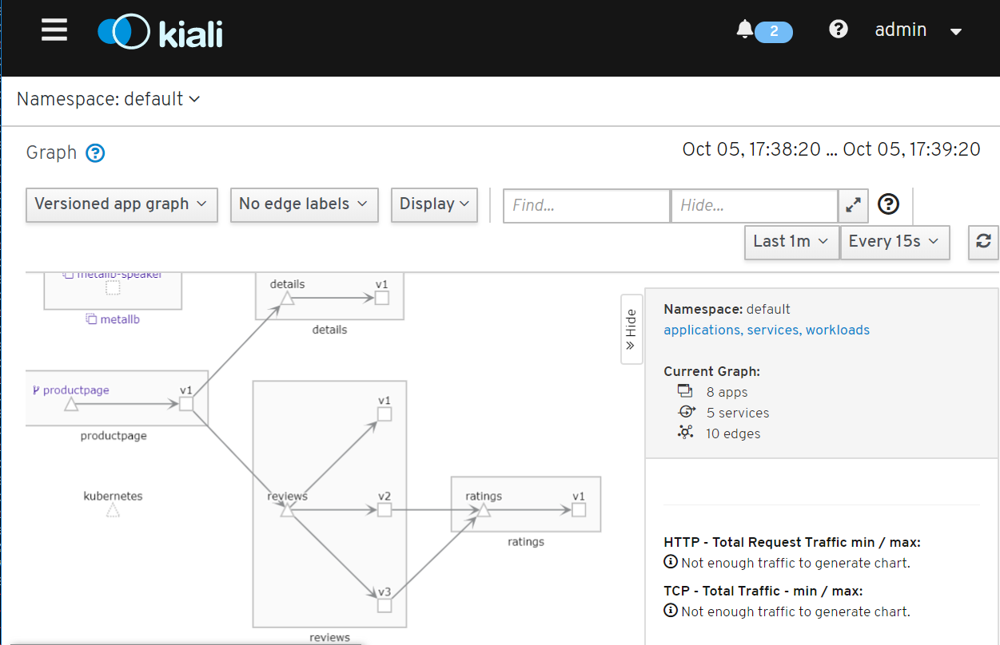
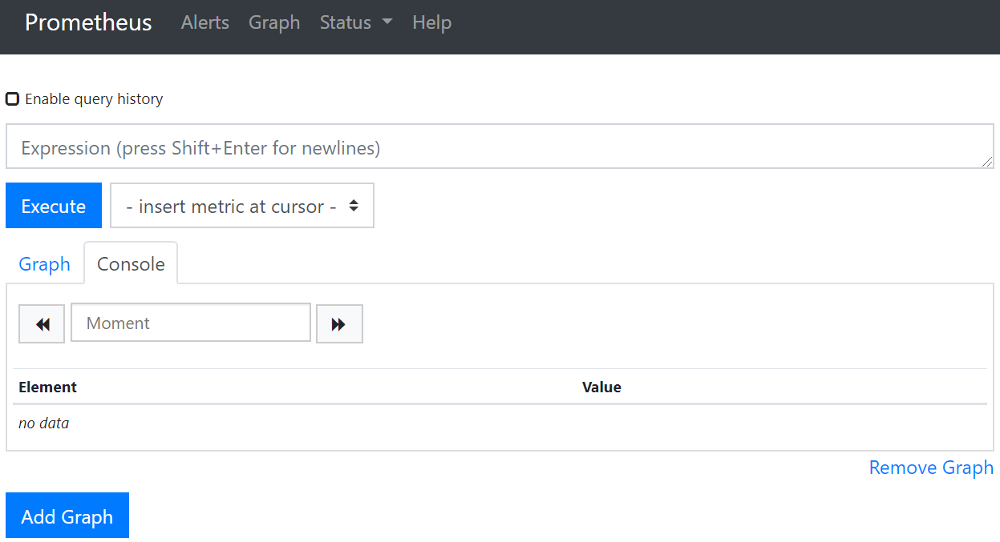
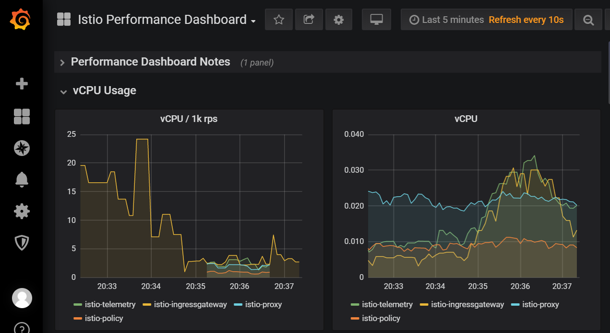
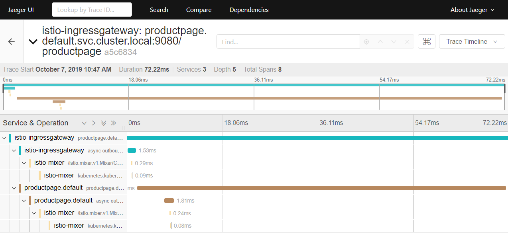

# 02.03_用Helm部署Istio_Service_Mesh

[Istio](https://istio.io/)是一种Kubernetes的Service Mesh。它的生产部署使用Helm。参考

- Istio Helm安装文档 <https://istio.io/docs/setup/install/helm/>
- Istio Helm源代码 <https://github.com/istio/istio/tree/1.3.0/install/kubernetes/helm>

## 用Helm部署Istio

### 添加Helm repo

```text
helm repo add istio.io https://storage.googleapis.com/istio-release/releases/1.3.0/charts/
helm repo update
```

搜索Helm chart

```text
vagrant@k8smaster:~$ helm search istio
NAME                    CHART VERSION   APP VERSION     DESCRIPTION
istio.io/istio          1.3.0           1.3.0           Helm chart for all istio components
istio.io/istio-cni      1.3.0           1.3.0           Helm chart for istio-cni components
istio.io/istio-init     1.3.0           1.3.0           Helm chart to initialize Istio CRDs
```

### 安装istio-init

检查istio-init chart的文档，发现docker image拉取由global.hub配置。

```text
$ helm inspect istio.io/istio-init | less

global:
  # Default hub for Istio images.
  # Releases are published to docker hub under 'istio' project.
  # Daily builds from prow are on gcr.io
  hub: docker.io/istio

  # Default tag for Istio images.
  tag: 1.3.0

  # imagePullPolicy is applied to istio control plane components.
  # local tests require IfNotPresent, to avoid uploading to dockerhub.
  # TODO: Switch to Always as default, and override in the local tests.
  imagePullPolicy: IfNotPresent

certmanager:
  enabled: false
```

使用镜像安装

```text
helm install istio.io/istio-init --name istio-init --namespace istio-system --set global.hub=dockerhub.azk8s.cn/istio
```

检查istio的crds

```text
vagrant@k8smaster:~$ sudo kubectl get crds | grep 'istio.io' | wc -l
23
```

### 安装istio

```text
helm install istio.io/istio --name istio --namespace istio-system --set global.hub=dockerhub.azk8s.cn/istio --set kiali.hub=quay.azk8s.cn/kiali --values https://github.com/istio/istio/raw/master/install/kubernetes/helm/istio/values-istio-demo.yaml
```

检查istio-system的pod，istio-init-crd开头的pod状态是Completed，其他的pod状态是Running。

```text
$ kubectl get all -n istio-system
NAME                                          READY   STATUS      RESTARTS   AGE
pod/istio-citadel-6d9dd6746b-jv9hp            1/1     Running     0          4m16s
pod/istio-galley-6498766df8-x2sxf             1/1     Running     0          4m16s
pod/istio-ingressgateway-85f5c957b7-rf9b7     1/1     Running     0          4m16s
pod/istio-init-crd-10-1.3.0-7rmvn             0/1     Completed   0          12m
pod/istio-init-crd-11-1.3.0-qzpld             0/1     Completed   0          12m
pod/istio-init-crd-12-1.3.0-hgttb             0/1     Completed   0          12m
pod/istio-pilot-6854f79558-mddf7              2/2     Running     0          4m16s
pod/istio-policy-86f8b9d54-sp2d2              2/2     Running     4          4m16s
pod/istio-sidecar-injector-6d4c7fcfb9-jkhfd   1/1     Running     0          4m16s
pod/istio-telemetry-5cf78b9c67-pzbdd          2/2     Running     4          4m16s
pod/prometheus-7d7b9f7844-dwkzc               1/1     Running     0          4m16s
```

### 删除Istio

如果需要，可以用以下命令删除Istio

```text
helm delete --purge istio
helm delete --purge istio-init
helm delete --purge istio-cni
kubectl delete namespace istio-system
```

## 安装bookinfo应用

参考<https://istio.io/docs/examples/bookinfo/#deploying-the-application>，部署bookinfo并且包括istio sidecar。

```text
# enable automatic sidecar injection to pods in namespace "default"
kubectl label namespace default istio-injection=enabled

kubectl apply -f https://raw.githubusercontent.com/istio/istio/release-1.3/samples/bookinfo/platform/kube/bookinfo.yaml
```

部署istio gateway使得bookinfo service能被外部访问。

```text
kubectl apply -f https://raw.githubusercontent.com/istio/istio/release-1.3/samples/bookinfo/networking/bookinfo-gateway.yaml
kubectl get gateway

export INGRESS_HOST=$(kubectl -n istio-system get service istio-ingressgateway -o jsonpath='{.status.loadBalancer.ingress[0].ip}')
export INGRESS_PORT=$(kubectl -n istio-system get service istio-ingressgateway -o jsonpath='{.spec.ports[?(@.name=="http2")].port}')
export SECURE_INGRESS_PORT=$(kubectl -n istio-system get service istio-ingressgateway -o jsonpath='{.spec.ports[?(@.name=="https")].port}')
export GATEWAY_URL=$INGRESS_HOST:$INGRESS_PORT
```

```text
$ curl -s http://${GATEWAY_URL}/productpage | grep -o "<title>.*</title>"
<title>Simple Bookstore App</title>
```

定义destination rule

```text
kubectl apply -f https://raw.githubusercontent.com/istio/istio/release-1.3/samples/bookinfo/networking/destination-rule-all.yaml
kubectl get destinationrules -o yaml
```

## 安装Istio的Telemetry Addon

参考<https://istio.io/docs/tasks/telemetry/gateways/#option-2-insecure-access-http>，依次打开Kiali、Prometheus、Grafana和Tracing。

查找每个addon的访问地址。

```text
$ kubectl describe svc/istio-ingressgateway -n istio-system
Type:                     LoadBalancer
LoadBalancer Ingress:     192.168.12.200
Port:                     https-kiali  15029/TCP
Port:                     https-prometheus  15030/TCP
Port:                     https-grafana  15031/TCP
Port:                     https-tracing  15032/TCP
```

| Addon名称 | 地址 |
| ------------- | ------------- |
| Kiali | <http://192.168.12.200:15029> |
| Prometheus | <http://192.168.12.200:15030> |
| Grafana | <http://192.168.12.200:15031> |
| Tracing | <http://192.168.12.200:15032> |

### Kiali

打开Kiali网页(<http://192.168.12.200:15029>)，要求用户名和密码来登陆。
从helm安装的YAML里发现用户名和密码是createDemoSecret触发产生的。进而找到对应的用户名和密码都是admin。

```text
# https://github.com/istio/istio/blob/master/install/kubernetes/helm/istio/values-istio-demo.yaml
kiali:
  enabled: true
  createDemoSecret: true

# https://github.com/istio/istio/blob/master/install/kubernetes/helm/istio/charts/kiali/templates/demosecret.yaml
data:
  username: YWRtaW4=   # admin
  passphrase: YWRtaW4= # admin
```

使用用户admin密码admin登陆后，可以看到服务的关系图。

注意：如果没有显示，要故意访问微服务来产生流量，好生成各个服务之间的关系。

```text
for ((i=0; i<10; i++)) { curl -s http://${GATEWAY_URL}/productpage | grep -o "<title>.*</title>"; }
```



### Prometheus

打开Prometheus网页(<http://192.168.12.200:15030>)



### Grafana

打开Grafana网页(<http://192.168.12.200:15031>)。使用用户admin密码admin登陆，点击左上角选择dashboard，可以看到。



### Tracing

打开Tracing网页(<http://192.168.12.200:15032>)


